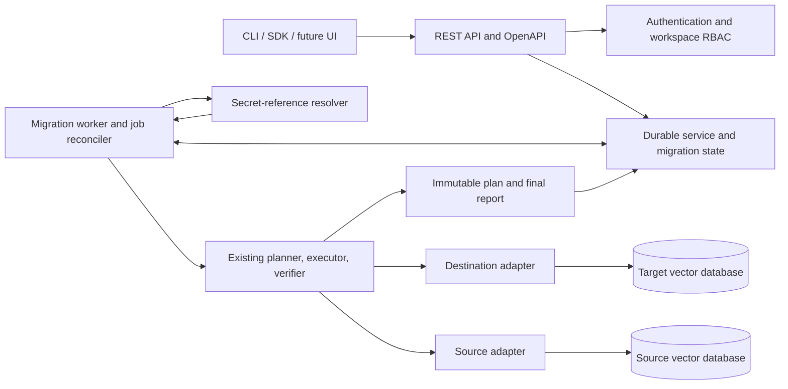
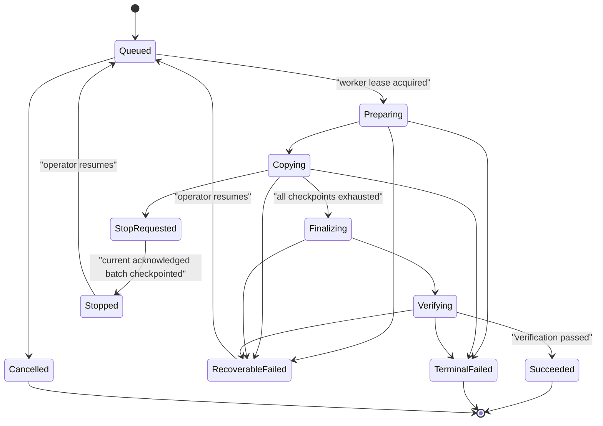

# VME MVP1 service architecture

**Status:** Local MVP1 implemented; enterprise HA profile remains a follow-on
**Date:** 2026-08-08
**Scope:** A consumable, self-hosted service for individual users and enterprise teams

## 1. Decision

Serve VME as an **asynchronous, self-hosted migration service** with two logical roles:

1. a REST control plane that owns profiles, plans, jobs, authorization, and status; and
2. a durable worker that resolves secrets, reaches the databases, and runs the existing migration
   engine.

Ship one OCI image with a production-oriented local/single-node profile now and preserve a clean
state-store boundary for a later HA enterprise profile:

- **Local:** API and worker in one process/container, SQLite WAL state, one active job, loopback by
  default, and environment/file secret references.
- **Enterprise target:** separate API and worker processes, PostgreSQL state, OIDC/RBAC, private
  ingress, mounted or externally injected secrets, and coordinated workers. PostgreSQL and HA
  deployment certification are intentionally not claimed by MVP1.

MVP1 is a self-hosted data plane, not a multi-tenant public SaaS. This keeps database credentials,
vectors, documents, and network access inside the user's environment. A hosted control plane with
customer-deployed agents can be added later without changing the job or adapter contracts.

The public service protocol is REST/OpenAPI. A migration request returns an asynchronous resource;
it never keeps an HTTP request open while data is copied.

## 2. Why this matches established migration systems

Data migration services consistently separate configuration from execution:

| Established practice | Evidence | VME mapping |
|---|---|---|
| Reusable source/target endpoints plus an execution task | [AWS DMS components](https://docs.aws.amazon.com/dms/latest/userguide/CHAP_Introduction.Components.html) | Connection profiles plus an immutable plan and job |
| Dedicated compute located where it can reach both databases | [AWS DMS replication instance](https://docs.aws.amazon.com/dms/latest/userguide/CHAP_ReplicationInstance.html) | Customer-deployed VME worker |
| Test endpoint connectivity before migration | [AWS DMS replication setup](https://docs.aws.amazon.com/dms/latest/userguide/CHAP_GettingStarted.Replication.html) | Connection-test resource |
| Discovery/assessment before full load | [Azure DMS workflow](https://learn.microsoft.com/en-us/azure/dms/faq) | Capability discovery and plan findings |
| Durable job state with stop/resume/restart actions | [Google DMS job actions](https://docs.cloud.google.com/database-migration/docs/postgres/migration-job-actions) | Durable desired/observed job state and checkpoint resume |
| Monitoring separate from execution | [AWS DMS task monitoring](https://docs.aws.amazon.com/dms/latest/userguide/CHAP_Monitoring.html) | Job status, counters, events, and report endpoints |
| Independent source/target validation | [AWS DMS data validation](https://docs.aws.amazon.com/dms/latest/userguide/CHAP_Validating.html) | Count, digest read-back, and semantic verification |
| Explicit switchover after synchronization | [Google DMS promotion](https://docs.cloud.google.com/database-migration/docs/postgres/promote-migration) | Manual cutover instructions after verification |
| Immutable history and checksums | [Flyway schema history](https://documentation.red-gate.com/flyway/flyway-concepts/migrations/flyway-schema-history-table) | Plan fingerprint, attempts, and append-only events |
| Persistent offsets for restart recovery | [Debezium state storage](https://debezium.io/documentation/reference/stable/configuration/storage.html) | Per-partition opaque checkpoints |
| Secret references instead of credentials in task definitions | [AWS DMS Secrets Manager integration](https://docs.aws.amazon.com/dms/latest/userguide/security_iam_secretsmanager.html) | Provider-neutral secret references resolved by the worker |

The VME planner is the vector-database equivalent of schema assessment/conversion. The execution
worker is the replication instance. The plan/job pair is the migration task. The verifier is an
independent validation phase.

## 3. Options considered

| Option | Decision | Reason |
|---|---|---|
| Synchronous REST wrapper around `run_migration()` | Reject | HTTP disconnects and API restarts must not own job lifetime. HTTP `202 Accepted` is designed for accepted but incomplete work and should point to a status monitor ([RFC 9110](https://datatracker.ietf.org/doc/html/rfc9110#name-202-accepted)). |
| FastAPI in-process background task | Reject | Migration is durable, heavy work. FastAPI recommends a separate worker/tool for heavy background computation ([FastAPI background tasks](https://fastapi.tiangolo.com/tutorial/background-tasks/#caveat)). |
| Centralized public SaaS data plane | Defer | It creates private-network connectivity, credential custody, data residency, and compliance obligations before the engine is mature. |
| Kubernetes Job per migration | Defer as an optional scheduler | It excludes local users and still requires idempotency because Kubernetes can start a Job more than once ([Kubernetes Jobs](https://kubernetes.io/docs/concepts/workloads/controllers/job/)). |
| Celery, Kafka, or Temporal in MVP1 | Reject | The engine already owns durable per-batch checkpoints and typed retries. A second workflow system adds operational and dual-state complexity without improving the first certified service path. |
| Durable API plus worker backed by the VME state store | Choose | Works locally, has a direct enterprise deployment path, and preserves the existing checkpoint-after-ack model. |

## 4. System architecture

The API is a control plane. It does not stream vectors and does not need source/destination
credentials. Only the worker resolves credentials and connects to the databases.

The API and worker may share a process in local mode. They remain separate components in code so
enterprise deployment can run them as separate processes without changing semantics.

## 5. Resource model

### 5.1 Workspace

A workspace is the authorization and audit boundary. Every profile, plan, job, event, and report
has a non-null `workspace_id`.

MVP1 supports multiple users inside an enterprise installation, but not multiple untrusted
customer organizations in a public SaaS control plane.

### 5.2 Connection profile

A connection profile contains:

- adapter name and role eligibility;
- non-secret network settings;
- TLS configuration;
- secret references;
- labels and ownership metadata.

It does not select a collection. Resource selection belongs to the migration definition so one
profile can be reused for multiple collections.

Resolved secrets are never returned by the API or persisted in profiles, plans, jobs, events, or
reports.

### 5.3 Migration definition

A mutable draft containing source/destination profile references, resource selectors, mappings,
consistency, execution limits, and verification policy.

Changing a migration definition never changes an existing plan or job.

### 5.4 Plan

An immutable assessment revision containing:

- sanitized inputs;
- discovered schemas and capabilities;
- findings and required acknowledgements;
- source/destination adapter versions;
- estimated count/bytes where available;
- plan fingerprint.

Plans have `planning`, `ready`, or `rejected` state. Only a `ready` plan can create a job.

### 5.5 Job and attempt

A job references exactly one immutable plan. Operational retries create attempts under the same
job; they do not mutate the plan. A job owns partition checkpoints, counters, events, samples, and
one final report.

### 5.6 Idempotency record

Every mutating API accepts an `Idempotency-Key`. The state store records the workspace, route,
request digest, and response resource. Reusing the key with the same request returns the original
result; using it with a different request returns `409 Conflict`.

## 6. Job lifecycle

Rules:

1. Adapter throttle/transient retries remain inside an attempt.
2. Authentication, compatibility, invariant, and validation failures are not hidden by whole-job
   retry loops.
3. A stop is cooperative. The worker finishes or abandons the in-flight request safely, persists
   the last acknowledged checkpoint, and then marks the job stopped.
4. A worker crash does not mark a job successful or advance a cursor. After its lease expires, the
   job becomes recoverable and can resume from its last committed checkpoint.
5. A job never deletes source data. Cancellation also does not implicitly delete a staging target.
6. Cutover is manual in MVP1 and is represented in the report, not as an automatic data-plane
   mutation.

## 7. Worker ownership and recovery

The state store is the durable queue; MVP1 does not need a separate broker.

1. The worker atomically claims a queued job and records `worker_id`, `lease_token`,
   `lease_expires_at`, and a heartbeat.
2. At most one valid lease may exist for a job.
3. The worker renews the lease while it owns the coordinator.
4. Checkpoint writes require the current lease token, preventing a stale worker from advancing
   state after ownership changes.
5. On lease expiry, a reconciler moves the job to recoverable state. Resume reuses deterministic
   IDs and destination upsert semantics.
6. One job has one coordinator. Existing bounded reader/writer concurrency stays inside that
   coordinator; partition-level distributed workers remain out of scope.

PostgreSQL workers can claim queue rows with `FOR UPDATE SKIP LOCKED`, a mechanism PostgreSQL
explicitly identifies as useful for queue-like tables
([PostgreSQL `SELECT`](https://www.postgresql.org/docs/current/sql-select.html#SQL-FOR-UPDATE-SHARE)).
SQLite local mode uses one process-level scheduler and a database transaction.

## 8. REST API surface

All routes are versioned under `/v1`. JSON is the only MVP1 representation except the Markdown
report download.

| Method and route | Purpose | Response |
|---|---|---|
| `GET /v1/adapters` | Installed adapters and configuration schemas | `200` |
| `POST /v1/connection-profiles` | Store sanitized connection settings and secret references | `201` |
| `GET /v1/connection-profiles` | List profiles visible to the workspace | `200` |
| `GET /v1/connection-profiles/{id}` | Read a sanitized profile | `200` |
| `POST /v1/migrations` | Create a mutable migration definition | `201` |
| `GET /v1/migrations/{id}` | Read a migration definition | `200` |
| `POST /v1/plans` | Create an immutable asynchronous assessment from a migration revision | `202` plus `Location` |
| `GET /v1/plans/{id}` | Read findings, fingerprint, and readiness | `200` |
| `POST /v1/jobs` | Queue a ready plan for execution | `202` plus `Location` |
| `GET /v1/jobs` | List jobs in the authenticated workspace | `200` |
| `GET /v1/jobs/{id}` | Current state, progress, attempt, and verification summary | `200` |
| `POST /v1/jobs/{id}/stop` | Request a checkpoint-safe stop | `202` |
| `POST /v1/jobs/{id}/resume` | Queue a stopped/recoverable job | `202` |
| `POST /v1/jobs/{id}/cancel` | Cancel a job that has not completed | `202` |
| `GET /v1/jobs/{id}/events?after={sequence}` | Paginated append-only event stream | `200` |
| `GET /v1/jobs/{id}/report` | Read the immutable JSON report | `200` |
| `GET /health/live` | Process liveness | `200` |
| `GET /health/ready` | State store and scheduler readiness | `200` or `503` |

An asynchronous response contains the resource ID, current state, status URL, and recommended poll
interval. MVP1 uses polling with monotonic event sequence numbers. Server-sent events and webhooks
are optional later transports over the same event log.

The CLI supports direct engine operation plus `vme serve` and `vme worker`. Remote API-client
commands remain a follow-on; MVP1 is consumable through REST/OpenAPI and any generated client.

## 9. State-store profiles

### 9.1 Local profile

- SQLite WAL on a durable local path;
- API and worker in one process/container;
- one certified active migration job;
- append-only events and reports in SQLite;
- suitable for a developer, operator workstation, or small private server.

### 9.2 Enterprise profile (target, not yet certified)

- PostgreSQL for service resources, leases, checkpoints, events, and reports;
- API and one worker coordinator as separate processes;
- Kubernetes/Docker restart policy for process recovery;
- `workspace_id` on all rows, with service-layer authorization and PostgreSQL row-level security
  as defense in depth ([PostgreSQL RLS](https://www.postgresql.org/docs/current/ddl-rowsecurity.html));
- backups and retention controlled by the enterprise operator.

PostgreSQL is required before calling the service highly available. SQLite remains correct for a
single process but is not the enterprise shared-state profile.

## 10. Authentication, authorization, and secret handling

### 10.1 Authentication modes

- **Local:** bind to `127.0.0.1` by default and use a generated bearer token. Disabling auth is
  allowed only when explicitly configured with loopback binding.
- **Enterprise-oriented auth:** OIDC JWT issuer, audience, expiry, signature, workspace claim, and
  roles are implemented. HA state and cross-workspace isolation certification still depend on the
  PostgreSQL profile.

Roles:

- `viewer`: read profiles without secret references, plans, jobs, events, and reports;
- `operator`: viewer rights plus test, plan, run, stop, resume, and cancel;
- `admin`: operator rights plus profile management, workspace policy, and retention.

### 10.2 Secret references

MVP1 defines a `SecretResolver` interface and certifies:

- `env:NAME` for local processes and container secret injection; and
- `file:/mounted/path#key` for Docker/Kubernetes/external-secret mounts.

Direct AWS Secrets Manager, Azure Key Vault, GCP Secret Manager, and Vault resolvers can be adapter
plugins later. Enterprise operators can already use those systems to inject short-lived values as
environment variables or mounted files.

The API rejects credential-looking plaintext fields such as `password`, `api_key`, `token`, and
authorization headers. It stores only references. The worker resolves a reference immediately
before probe/run and keeps the value in memory only.

### 10.3 Network and data controls

- TLS verification is on by default; disabling it creates a blocking or explicitly acknowledged
  plan finding.
- The service enforces explicit adapter, local-data-root, and `host-or-CIDR:port` endpoint
  allowlists and requires TLS by default. Enterprise deployments must enforce the same policy at
  the network layer to deny cloud metadata, loopback, link-local, cluster-management, and
  container-runtime endpoints even if application validation is bypassed.
- Only preinstalled adapters can run. Runtime upload/import of arbitrary Python plugins is disabled.
- Logs/events never contain vectors, documents, metadata, secrets, or sensitive request headers.
- Audit events include actor, workspace, request ID, action, resource, result, and timestamp.
- Source and destination credentials should be least privilege and independently scoped.

## 11. Observability

The implemented local MVP1 exposes:

- an append-only durable event stream;
- job counters for records, bytes, batches, and verification mismatches;
- lease-backed job ownership and queue state;
- health/readiness endpoints;
- a final sanitized JSON report.

Structured logging, Prometheus/OpenTelemetry export, retry/throttle metrics, and a Markdown report
remain follow-on work. The durable event log is the product source of truth for job history.

## 12. MVP1 scope boundary

Included:

- REST/OpenAPI control plane;
- local/single-node self-hosted deployment profile;
- reusable connection profiles; planning probes both endpoints and performs source discovery;
- immutable plans and fingerprints;
- asynchronous jobs with durable leases;
- safe stop/resume/cancel;
- one coordinator per job and bounded in-process concurrency;
- SQLite WAL state with a provider-neutral executor state-store protocol;
- OIDC workspace RBAC and generated local token mode;
- environment/file secret references;
- status, event, health, and report endpoints;
- Chroma-to-Qdrant migration through the existing engine.

Explicitly deferred:

- PostgreSQL state, multiple API/worker replicas, and HA certification;
- dedicated connection-test resources, profile updates, and migration updates;
- API-client CLI commands and generated SDK publication;
- network-layer egress templates, ingress rate-limit examples, and enterprise manifests;
- public multi-tenant SaaS and billing;
- browser UI;
- hosted control plane/customer-agent protocol;
- CDC, dual writes, and near-zero-downtime catch-up;
- automatic alias/application cutover;
- distributed partition execution;
- dynamic adapter installation;
- Celery/Kafka/Temporal dependency;
- Kubernetes Job-per-migration scheduling;
- automatic source or staging-target deletion.

## 13. Implementation status

Reusable without redesign:

- canonical records and adapter registry;
- capability planner and immutable fingerprint;
- bounded executor and typed retries;
- checkpoint-after-ack behavior;
- Chroma/Qdrant adapters;
- count and digest verification;
- SQLite schema concepts and append-only events.

Completed service slice:

1. Extract a `StateStore` protocol from `SQLiteStateStore`; add service resources, desired state,
   attempts, leases, actors/workspaces, idempotency records, and event pagination.
2. Add cooperative stop/cancel tokens and recoverable/terminal job states to the executor.
3. Add connection-profile and secret-resolver models without resolved secrets in durable state.
4. Add the FastAPI control plane, OpenAPI, typed problem responses, and idempotency keys.
5. Add local-token and OIDC authentication plus workspace RBAC/audit context.
6. Add the job reconciler, plan/job heartbeats, startup recovery, reports, and health surfaces.
7. Add a non-root OCI image and hardened local Compose example.

Next enterprise slice: PostgreSQL queue/checkpoint state, atomic idempotency under multiple API
replicas, network-layer egress templates, published API clients, metrics export, and HA
manifests/tests.

## 14. Local MVP1 acceptance criteria

1. Creating the same job twice with one idempotency key produces one durable job.
2. API restart or client disconnect does not stop an active migration.
3. Killing the worker before write, after write, and before checkpoint resumes without logical loss
   or duplicate records.
4. Stop becomes effective only at a safe checkpoint and resume retains the plan fingerprint.
5. A stale worker lease cannot commit a checkpoint.
6. Planning probes/discovery write no destination data.
7. No resolved secret appears in database rows, logs, events, reports, API responses, or exception
   text.
8. Viewer/operator/admin permissions are enforced for every implemented resource and action.
9. The existing 20-document MiniLM Chroma-to-Qdrant test passes through the REST API and worker,
    including count, digest, and semantic-overlap checks.
10. A queued job remains durable across service restart and is available for reconciliation.
11. No API action deletes source data or performs automatic cutover.

## 15. Recommended build order

1. State-store protocol and expanded SQLite schema.
2. Job service/reconciler with leases, stop/resume, and no HTTP layer.
3. REST profiles, plans, jobs, events, and reports using local token auth.
4. End-to-end local Compose certification using the live integration corpus.
5. PostgreSQL state store, replica-safe idempotency, and lease-fencing tests.
6. NetworkPolicy/firewall templates, ingress rate limits, metrics, and API-client CLI/SDK generation.
7. Enterprise deployment manifest and restart/failure certification.

This order proves durability before adding network presentation or enterprise deployment machinery.
