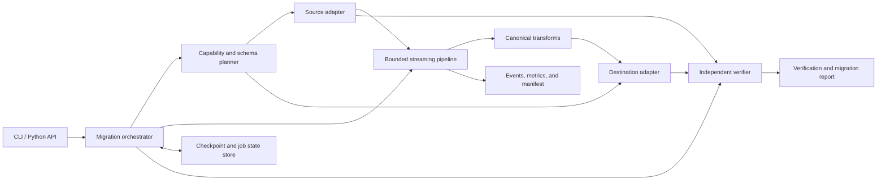
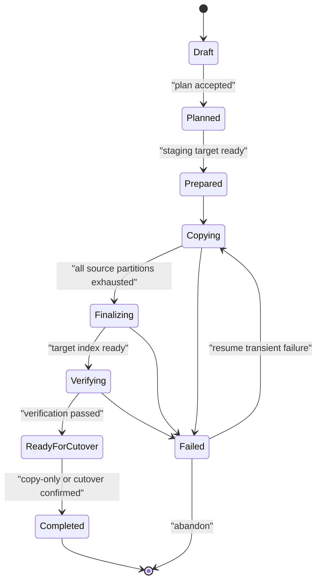

# Vector Migration Engine v1 architecture

**Status:** Proposed for implementation  
**Date:** 2026-08-08  
**Branch:** `feature/v1.0`  
**Research:** [Vector database migration research](../research/vector-database-capability-matrix.md)

## 1. Decision summary

VME v1 will be a **capability-aware, adapter-based migration engine**. It will migrate logical records through one bounded, resumable pipeline instead of implementing a class for every source/destination pair.

The core decisions are:

- Use native database SDKs inside adapters. LangChain may be supported by a compatibility importer, but it is not the migration abstraction.
- Represent source data as a canonical stream of IDs, isolation scopes, vector fields, documents, metadata, and optional links.
- Discover source and destination capabilities at runtime and compile an immutable migration plan before copying data.
- Reject silent data loss. Unsupported features require an explicit policy and are recorded in a loss/transform report.
- Provide at-least-once transfer with idempotent destination writes and checkpoint-after-ack recovery.
- Keep memory bounded by records and bytes, use adaptive batches and backpressure, and let adapters select target-specific bulk-load strategies.
- Verify schema, counts, record digests, vector fidelity, and representative query behavior independently of transfer success.
- Treat physical ANN indexes as target-built artifacts. VME migrates vectors and search intent, not HNSW/IVF graph files across products.
- Make offline/quiesced snapshot migration reliable first. Add near-zero-downtime catch-up only for adapters that can prove a stable change boundary.

This changes adapter growth from roughly `N × (N - 1)` pair implementations to `N` source implementations plus `N` sink implementations.

## 2. Problem statement

The current proof of concept contains pair-specific transformations and uses vector-store wrappers that do not expose enough information for reliable migration. It has no general export contract, schema compatibility phase, recovery state, or independent verification.

A production migration engine must answer these questions before it starts copying:

- Can the source expose the original vectors, IDs, documents, metadata, and tenant/namespace boundaries?
- Can the target represent every vector field and metadata value without loss?
- Are vector dimension, type, normalization, and metric compatible?
- Is the source scan stable while application writes continue?
- Is retry safe, and from which exact cursor can execution resume?
- How will the migration prove completeness and semantic equivalence?
- Which database-specific loading path is fastest without weakening correctness?

## 3. Goals and non-goals

### 3.1 Goals

1. Support migrations among multiple vector stores through an extensible adapter interface.
2. Preserve existing embeddings by default, avoiding expensive and behavior-changing re-embedding.
3. Preserve IDs, scopes, documents, and metadata whenever the destination supports them.
4. Produce a deterministic compatibility plan with errors, warnings, transformations, and estimated work.
5. Stream datasets larger than available memory.
6. Resume safely after process, network, or service failures.
7. Validate destination contents and search behavior before cutover.
8. Expose CLI and Python APIs backed by the same orchestration service.
9. Keep provider credentials optional and isolated through install extras and adapter configuration.

### 3.2 Non-goals for v1

- Copying a vendor's physical ANN index graph or proprietary backup format into a different vendor.
- Universal change-data-capture or a universal zero-downtime guarantee.
- Automatically changing the application's query/filter syntax.
- Automatically choosing a different embedding model.
- Silently flattening schemas, dropping fields, changing IDs, or changing metric semantics.
- Deleting the source after migration.
- Distributed orchestration across multiple VME worker machines. The interfaces will not prevent it, but v1 runs one coordinator process.

## 4. Architectural principles

### 4.1 Correctness precedes throughput

The planner blocks an invalid or lossy migration before provisioning the destination. Performance tuning begins only after the logical mapping is valid.

### 4.2 Capabilities are runtime facts

Capabilities depend on server version, SDK version, index type, deployment tier, and collection configuration. An adapter descriptor may advertise possible features, but `probe()` returns the effective capabilities for the configured resource.

### 4.3 No pair-specific business logic

Source-specific behavior stays in a source adapter, destination-specific behavior stays in a sink adapter, and portable transformations stay in named transform stages. There will be no `TransformFaissToChroma`-style classes in the core.

### 4.4 Make loss visible

Every non-identity mapping has a reason, policy, and report entry. The default action for an unsupported populated feature is `error`.

### 4.5 Prefer replayable operations

The portable guarantee is at-least-once delivery. A sink must either support deterministic upsert or write to a fresh staging resource where replay is safe.

## 5. System context



The coordinator owns lifecycle and correctness. Adapters own vendor API behavior. The state store owns durable progress, while reports are immutable user-facing artifacts.

## 6. Canonical domain model

The canonical model is a logical interchange contract, not a new database. It exists in memory as typed objects and, when spilling or staging is required, as a versioned Arrow/Parquet representation.

### 6.1 Vector values

```python
ExternalId = str | int

class DenseVector:
    values: FloatBuffer
    dtype: Literal["float32", "float16", "bfloat16", "int8", "uint8"]

class SparseVector:
    indices: IntBuffer
    values: FloatBuffer
    dimension: int | None

class BinaryVector:
    values: BytesLike
    dimension_bits: int

class MultiVector:
    rows: Sequence[DenseVector | BinaryVector]

VectorValue = DenseVector | SparseVector | BinaryVector | MultiVector
```

Typed contiguous buffers avoid turning every coordinate into a Python object. Adapters should use NumPy/Arrow-compatible buffers and copy only when an SDK requires it.

### 6.2 Record

```python
class RecordScope:
    namespace: str | None
    tenant: str | None
    partition: str | None

class VectorRecord:
    id: ExternalId
    scope: RecordScope
    vectors: Mapping[str, VectorValue]
    document: str | None
    metadata: JsonObject
    links: Sequence[RecordLink]
    source_version: str | int | None
```

Rules:

- Vector names are preserved. An unnamed source vector uses the canonical name `default`.
- `document` remains separate from metadata because several stores treat it specially.
- `links` preserve reference/edge information long enough for the planner to reject, drop, or map it explicitly.
- `source_version` may hold an update timestamp, sequence number, or ETag when available; it is not assumed to exist.
- Adapter-private values never enter the portable record. Opaque source information belongs in a separately declared extension and cannot reach a sink without an explicit transform.

### 6.3 Collection specification

```python
class VectorFieldSpec:
    name: str
    kind: Literal["dense", "sparse", "binary", "multi"]
    dimension: int | None
    dtype: str
    metric: MetricSpec
    normalized: bool | None
    embedding_provenance: EmbeddingProvenance | None

class CollectionSpec:
    identity: ResourceIdentity
    vector_fields: Mapping[str, VectorFieldSpec]
    metadata_schema: MetadataSchema
    id_constraints: IdConstraints
    isolation: IsolationSpec
    links: LinkSchema
    index_intent: IndexIntent
```

`IndexIntent` captures search-oriented settings such as exact/approximate search, HNSW/IVF family preference, quantization intent, and filter indexes. It is advisory. The sink maps intent to its own supported configuration and reports deviations.

### 6.4 Metric model

`MetricSpec` separates:

- mathematical operation (`cosine`, `dot`, `euclidean`, `squared_euclidean`, `manhattan`, `hamming`, `jaccard`, `bm25`);
- return convention (`similarity` or `distance`);
- ordering (`higher_is_better` or `lower_is_better`);
- normalization behavior (`required`, `automatic`, `none`, or `unknown`).

This avoids treating identically named SDK values as numerically interchangeable. A `MetricMapping` says whether a destination mapping is:

- `exact`;
- `ranking_equivalent` with a documented score transform; or
- `incompatible`.

## 7. Adapter architecture

### 7.1 Packaging and discovery

Adapters are plugins discovered through the Python entry-point group `vme.adapters`. Provider dependencies are optional extras, for example:

```text
vme[chroma]
vme[qdrant]
vme[weaviate]
vme[faiss]
```

An adapter package exports a descriptor containing:

- stable adapter name and adapter API version;
- installed adapter implementation version;
- supported source and/or sink roles;
- configuration JSON Schema;
- supported SDK/server version ranges;
- capability vocabulary version;
- factory functions.

Core code must not import provider SDKs.

### 7.2 Capability model

Capabilities are structured values, not a flat list of booleans. The initial vocabulary includes:

```text
read.schema
read.stable_cursor
read.snapshot
read.by_id
read.exact_count
read.change_feed
write.create_resource
write.idempotent_upsert
write.streaming
write.bulk_import
write.read_after_write
write.defer_indexing
write.alias_cutover
vector.dense
vector.sparse
vector.binary
vector.named
vector.multi
metadata.nested
metadata.arrays
metadata.typed_schema
scope.namespace
scope.tenant
scope.partition
```

Each capability can carry limits such as maximum batch count/bytes, supported metrics, allowed ID types, dimensions, metadata types, and concurrency constraints.

### 7.3 Source adapter contract

Illustrative async interface:

```python
class SourceAdapter(Protocol):
    async def probe(self) -> SourceCapabilities: ...
    async def discover(self, selector: ResourceSelector) -> SourceSpec: ...
    async def open_read(self, consistency: ConsistencyRequest) -> ReadSession: ...
    async def partitions(self, session: ReadSession) -> Sequence[SourcePartition]: ...
    async def read_batch(
        self,
        session: ReadSession,
        partition: SourcePartition,
        cursor: OpaqueCursor | None,
        limit: BatchLimit,
    ) -> ReadBatch: ...
    async def read_by_ids(self, ids: Sequence[ScopedId]) -> Sequence[VectorRecord]: ...
    async def count(self, partition: SourcePartition) -> CountResult: ...
    async def close(self) -> None: ...
```

`ReadBatch` contains records, the cursor for the next read, an `exhausted` flag, and source diagnostics. The cursor is an adapter-versioned opaque JSON value. Core never interprets it.

### 7.4 Destination adapter contract

```python
class DestinationAdapter(Protocol):
    async def probe(self) -> DestinationCapabilities: ...
    async def inspect(self, selector: ResourceSelector) -> DestinationState: ...
    async def prepare(self, plan: DestinationPlan) -> PreparedDestination: ...
    async def write_batch(
        self,
        destination: PreparedDestination,
        batch: RecordBatch,
    ) -> BatchWriteResult: ...
    async def flush(self, destination: PreparedDestination) -> None: ...
    async def finalize(self, destination: PreparedDestination) -> FinalizeResult: ...
    async def read_by_ids(self, ids: Sequence[ScopedId]) -> Sequence[VectorRecord]: ...
    async def count(self, scope: RecordScope) -> CountResult: ...
    async def cutover(self, request: CutoverRequest) -> CutoverResult: ...
    async def close(self) -> None: ...
```

`BatchWriteResult` reports accepted IDs, rejected IDs with typed errors, server operation IDs, observed latency, and optional throttle guidance. A request-level success without per-record accounting is represented explicitly.

### 7.5 Optional bulk writer contract

A sink advertising `write.bulk_import` may also implement:

```python
class BulkDestinationAdapter(Protocol):
    async def stage_batch(self, batch: RecordBatch) -> StagedPart: ...
    async def submit_import(self, parts: Sequence[StagedPart]) -> ImportJob: ...
    async def poll_import(self, job: ImportJob) -> ImportStatus: ...
```

Staged parts are immutable, checksummed, and checkpointed. The core chooses bulk mode only when the plan proves its target-specific restrictions are satisfied.

## 8. Compatibility planning

`vme plan` performs no destination data writes. It discovers both endpoints and produces an immutable plan artifact.

### 8.1 Planner algorithm

1. Probe adapter and server versions.
2. Discover source collections, scopes, schemas, counts, and vector fields.
3. Inspect the destination resource and collision state.
4. Map vector shapes, dimensions, dtypes, and metrics.
5. Map IDs and detect scope-flattening collisions.
6. Map documents, metadata fields, nullability, arrays, and links.
7. Select target resource topology and index intent.
8. Select source consistency and destination write strategy.
9. Estimate records, vector bytes, API calls, and temporary storage where possible.
10. Emit findings and a reproducible plan fingerprint.

### 8.2 Findings

Every finding has a stable code, severity, source path, destination path, evidence, and required action:

- `ERROR`: execution is impossible or would be silently incorrect;
- `WARNING`: execution is possible only with an explicit accepted tradeoff;
- `INFO`: operational note or optimization.

Examples:

```text
VME-METRIC-002  WARNING  Euclidean mapped to squared Euclidean;
                         ranking is equivalent, score thresholds must change.
VME-ID-004      ERROR    source string IDs cannot be preserved by uint64 target policy.
VME-SCOPE-003   ERROR    flattening namespaces creates 147 duplicate IDs.
VME-META-006    WARNING  field metadata.geo will be JSON-encoded as a string.
VME-CONS-001    WARNING  source scan is best-effort while concurrent writes continue.
```

Warnings require a matching policy in configuration or an explicit acknowledgement recorded in the plan.

### 8.3 Mapping policies

Defaults are conservative:

| Area | Default | Explicit alternatives |
|---|---|---|
| Unsupported vector field | `error` | drop field, re-embed from document |
| Vector dimension mismatch | `error` | re-embed; user-supplied transform plugin |
| Metric mismatch | `exact_only` | ranking-equivalent mapping with acknowledgement |
| ID mismatch | preserve | stringify, deterministic UUID, surrogate sidecar |
| Scope mismatch | preserve | target-per-scope, flatten into metadata, rename map |
| Unsupported metadata | `error` | drop selected field, stringify selected field, custom transform |
| Links/references | `error_if_present` | drop or custom mapping |
| Existing destination | `error` | verified upsert, replace staging resource |

Re-embedding is a separate transform with its own model configuration, cost estimate, content requirements, and semantic validation. It is never an incidental response to a dimension or metric mismatch.

### 8.4 Plan fingerprint

The plan fingerprint covers:

- sanitized configuration;
- source and destination identities;
- discovered schemas and capability snapshots;
- adapter implementation versions;
- all accepted policies and transforms;
- selected write and verification strategies.

Resume refuses a changed fingerprint unless the user creates a new migration job.

## 9. Execution model

### 9.1 Lifecycle



Cutover is manual by default. Source deletion is never part of this state machine.

### 9.2 Streaming path

For each source partition:

1. Read a bounded batch from the last durable source cursor.
2. Convert SDK objects into canonical records.
3. Apply deterministic, planned transforms.
4. Validate record invariants and calculate canonical digests.
5. Add records to a destination batch constrained by both record count and serialized bytes.
6. Write and await destination acknowledgement.
7. Persist batch result, digests, counters, and the next source cursor in one state-store transaction.
8. Release batch memory.

If the process stops after step 6 but before step 7, the batch is replayed. Idempotent upsert makes this safe.

### 9.3 Bounded concurrency and backpressure

The executor uses:

- one reader task per allowed source partition;
- a bounded record/byte queue;
- a deterministic transform stage;
- a byte-aware batcher;
- a destination concurrency semaphore;
- an adaptive controller informed by latency, throttling, retry-after hints, and error rate.

The memory bound is approximately:

```text
reader batches + queued batches + in-flight writer batches + SDK overhead
```

All four terms have configured maxima. Dataset cardinality does not affect process memory complexity.

Adapters publish limits; the executor chooses the minimum of adapter limits, user limits, and adaptive limits. A provider's automatic server-side batching can replace VME writer concurrency when the sink declares that it manages backpressure itself.

### 9.4 Performance strategies

The portable baseline is streaming upsert. Adapters can safely improve it by:

- using column-oriented SDK calls;
- selecting gRPC when supported;
- deferring or lowering ANN index construction during a fresh load;
- staging Parquet for a target bulk-import API;
- using PostgreSQL `COPY` and creating vector indexes afterward;
- building a FAISS index locally and atomically publishing the completed bundle;
- parallelizing independent scopes without violating source cursor guarantees;
- excluding unused response fields and avoiding vector copies.

Optimization selection and every temporary target setting are part of the plan. `finalize()` restores the requested durable/index configuration and waits for readiness.

### 9.5 Source consistency

Every job records one consistency mode:

- `snapshot`: immutable file/backup or database snapshot token;
- `quiesced`: the operator guarantees source writes are stopped;
- `bounded`: scan is limited by an adapter-provided high-water mark;
- `best_effort`: no stable boundary; allowed only with acknowledgement.

V1's certified correctness path is `snapshot` or `quiesced`. Future live migration is an initial snapshot plus a change-feed/high-watermark catch-up stage implemented only by adapters that support it. Polling an unstable collection repeatedly is not labeled CDC.

## 10. Durable state and recovery

### 10.1 State store

V1 uses SQLite in WAL mode by default behind a `StateStore` interface. A future PostgreSQL implementation can support distributed workers without changing adapters.

Logical state includes:

- `jobs`: identity, fingerprint, lifecycle state, timestamps, sanitized config;
- `resources`: discovered source/destination specifications;
- `partitions`: opaque source cursor, state, counters, latest error;
- `batches`: source range/cursor, record and byte counts, digest summary, write result;
- `imports`: staged parts and provider bulk-job IDs;
- `findings`: accepted planning findings;
- `events`: append-only lifecycle and diagnostic events.

State changes after a destination acknowledgement and cursor advancement occur in one SQLite transaction.

### 10.2 Resume rules

Resume is allowed only if:

- the plan fingerprint matches;
- adapters can decode their stored cursor versions;
- the destination still matches the prepared identity;
- the selected write strategy is replay-safe;
- no non-retriable data/schema failure remains unacknowledged.

If an adapter upgrade cannot decode an older cursor, it must provide a cursor migration or fail with a precise instruction. It must not restart from zero against an unsafe target.

### 10.3 Failure classification

| Class | Examples | Behavior |
|---|---|---|
| Throttle | HTTP 429, capacity signal | Honor retry-after, reduce concurrency, retry with jitter |
| Transient | timeout, connection reset, temporary 5xx | Bounded exponential backoff and retry |
| Authentication/authorization | invalid key, forbidden collection | Fail fast; no retries that can hide the cause |
| Compatibility | schema changed, dimension mismatch | Fail job; require a new plan |
| Record data | invalid ID or metadata value | Fail by default; optional explicit quarantine policy |
| Invariant | wrong acknowledgement, cursor regression, digest mismatch | Stop immediately and preserve diagnostics |

Quarantine stores record identity, scope, error, and digest by default. Storing full documents, metadata, or vectors requires an explicit secure-artifact option.

## 11. Verification

Transfer acknowledgements prove that requests were accepted, not that the final target is equivalent. Verification is a separate phase.

### 11.1 Levels

1. **Schema:** destination vector fields, dimensions, metrics, ID mapping, scope topology, and mapped metadata schema match the plan.
2. **Count:** exact counts per collection/scope when supported. Approximate service counters are never treated as exact.
3. **Read-back sample:** deterministic samples by hashed source ID compare mapped records with target records.
4. **Full digest:** scan both sides and compare partitioned multiset digests.
5. **Query behavior:** run representative query vectors on both stores and compare top-k overlap/recall and optional NDCG, with ANN tolerance.

The default v1 profile is schema + exact count where available + deterministic read-back sampling. Release/cutover guidance recommends full digest for critical datasets.

### 11.2 Canonical record digest

A record digest covers the post-transform representation:

```text
scope || typed-id || vector-name/type/dimension/dtype/values ||
canonical-json(metadata) || document || mapped-links
```

Vectors use a canonical byte order and dtype. Float comparisons can use an explicit tolerance when the plan includes normalization or dtype conversion; the original and target-side norms/errors are reported.

For order-independent full verification, records are assigned to deterministic hash buckets by scoped ID. Each bucket records count, byte count, XOR of SHA-256 record digests, and modular digest sum. Bucket mismatches can be narrowed without holding every ID in memory.

### 11.3 Semantic query verification

ANN indexes can return different but valid neighbors. Query validation therefore reports rather than demands byte-for-byte ranking identity:

- top-k intersection/recall;
- rank correlation or NDCG where applicable;
- distance/score comparison after the planned score transform;
- latency as observational data, not a cross-product correctness assertion.

Thresholds are configurable per migration and metric mapping. A failed semantic threshold blocks automatic readiness for cutover.

## 12. Destination provisioning and cutover

### 12.1 Staging by default

VME creates or requires a fresh staging resource unless the plan proves in-place idempotent upsert is safe. The staging resource name is deterministic from the job ID and user-provided prefix.

Benefits:

- retry does not mix with unrelated data;
- target indexes can be tuned for bulk load;
- verification is isolated;
- rollback means keeping the application on the old resource.

### 12.2 Cutover

Cutover strategies are capability-based:

- atomic alias swap when the target supports it;
- rename/swap when safely supported;
- generated application configuration change instructions;
- copy-only completion when VME cannot own application routing.

The default is a confirmation gate after verification. VME records the cutover result but never deletes the source or previous target automatically.

## 13. User interface and configuration

### 13.1 CLI

```text
vme adapters
vme inspect --endpoint source
vme plan --config migration.yaml --out plan.json
vme run --plan plan.json
vme status <job-id>
vme resume <job-id>
vme verify <job-id> --level full
vme report <job-id> --format json|markdown
```

`plan` is read-only. `run` provisions/writes the destination. `verify` is read-only against both data stores. Destructive cleanup will be a separate, explicit command outside v1's default flow.

### 13.2 Configuration example

```yaml
apiVersion: vme.io/v1
kind: Migration

metadata:
  name: product-embeddings-to-qdrant

source:
  adapter: weaviate
  connection:
    url: https://source.example
    api_key: env:WEAVIATE_API_KEY
  resource:
    collection: Product
    tenants: "*"

destination:
  adapter: qdrant
  connection:
    url: https://target.example
    api_key: env:QDRANT_API_KEY
  resource:
    collection: product_v1_staging
    create: true

mapping:
  vectors:
    default:
      to: text
      metric: exact_only
  ids:
    policy: deterministic_uuid
    namespace: 60f5f0b8-6574-4b98-9f55-e365efa51e20
  scopes:
    tenant:
      to: payload
      field: _tenant
  metadata:
    unsupported: error
  links:
    unsupported: error_if_present

consistency:
  mode: quiesced

execution:
  strategy: auto
  batch:
    max_records: 500
    max_bytes: 8388608
  concurrency:
    readers: 2
    writers: 4
  retry:
    max_attempts: 8

verification:
  schema: true
  count: exact
  sample:
    records: 1000
  query:
    sample_queries: 100
    top_k: 20
    min_overlap: 0.90

cutover:
  mode: manual
```

Secrets are references resolved at runtime. Resolved values are never written to plans, checkpoints, reports, logs, or exception messages.

## 14. Observability and reports

### 14.1 Structured events

Every event includes job ID, stage, adapter, resource, scope/partition, attempt, record count, bytes, latency, and a redacted error classification where applicable.

### 14.2 Metrics

Initial metrics:

- records/bytes read, transformed, written, retried, quarantined, and verified;
- read/write batches and in-flight batches;
- source, transform, destination, and checkpoint latency;
- throttle count and retry delay;
- queue depth in records and bytes;
- estimated remaining work when counts are reliable;
- verification mismatch counts and query-quality scores.

Human logs are derived from the same event stream. Adapters do not print directly.

### 14.3 Final report

The immutable report contains:

- endpoint identities and sanitized versions;
- accepted plan and findings;
- source consistency level;
- schema and metric mappings;
- record/byte totals by scope;
- retries, quarantines, and failures;
- verification evidence;
- performance summary;
- cutover status and rollback instructions;
- every lossy or semantic transformation.

## 15. Security requirements

- Resolve secrets from environment variables or a future secret-provider interface.
- Redact credentials and sensitive headers centrally before event persistence.
- Require TLS verification by default; disabling it is a plan warning.
- Recommend least-privilege source read and destination create/write credentials.
- Never log vector values, documents, or metadata by default.
- Restrict checkpoint and staged-artifact filesystem permissions where the platform supports it.
- Checksum downloaded FAISS bundles before deserialization; unsafe pickle-based sidecars require an explicit trust flag and warning.
- Do not place secrets in adapter opaque cursors.

## 16. Proposed repository structure

```text
src/vme/
  __init__.py
  cli.py
  api.py
  domain/
    records.py
    schema.py
    metrics.py
    capabilities.py
    findings.py
  adapters/
    base.py
    registry.py
    chroma/
    qdrant/
    weaviate/
    faiss_bundle/
  planning/
    planner.py
    vector_mapping.py
    metadata_mapping.py
    topology.py
  execution/
    orchestrator.py
    pipeline.py
    batching.py
    retry.py
    transforms.py
  state/
    base.py
    sqlite.py
    migrations/
  verification/
    schema.py
    digests.py
    sampling.py
    queries.py
  reporting/
    events.py
    metrics.py
    report.py
tests/
  unit/
  contract/
  integration/
  fault_injection/
```

The existing proof-of-concept files remain only as historical examples until the new core has an end-to-end path; they should not become dependencies of `vme`.

## 17. Adapter certification

Every first-party adapter must pass the same contract suite.

### 17.1 Source contract

- discovers schemas and effective capabilities;
- returns all records exactly once in a stable/quiesced fixture scan;
- preserves vector names, dimensions, dtypes, IDs, scopes, documents, and metadata;
- resumes from every emitted cursor without gaps;
- classifies auth, transient, and record errors correctly;
- closes connections on success, cancellation, and failure.

### 17.2 Destination contract

- provisions the planned schema or reports an exact incompatibility;
- accepts a bounded batch and reports per-record/request outcome;
- safely replays a committed batch under the declared strategy;
- exposes read-back and exact count where advertised;
- finalizes temporary index settings and waits for readiness;
- never mutates an unrelated resource.

### 17.3 Pair integration

For all directed pairs of certified v1 adapters, fixtures cover:

- empty, single-record, and multi-batch collections;
- duplicate IDs across scopes;
- dense cosine, dot, and L2 vectors;
- documents absent/present;
- nested and edge-case metadata within the supported intersection;
- injected failure before write, after write, and before checkpoint;
- interrupted run followed by resume;
- schema/count/sample/full-digest verification.

Features outside a pair's intersection must produce the expected planning error or explicitly accepted transform.

## 18. Delivery plan

### Milestone 1: core contracts and reference path

- Package the project as `vme` with a real CLI.
- Implement canonical domain types, capabilities, findings, adapter registry, planner skeleton, SQLite state store, and bounded pipeline.
- Implement Chroma and Qdrant as the first native reference adapters.
- Complete plan, run, resume, schema/count/sample verification, and reports.

### Milestone 2: v1 connector set

- Add Weaviate, including named-vector and tenant discovery.
- Add the versioned FAISS bundle adapter with explicit sidecars.
- Add full-digest and query-behavior verification.
- Add fault-injection and all-pairs integration tests.

The v1.0 release is certified for the supported feature intersection among Chroma, Qdrant, Weaviate, and FAISS bundles. The domain model and planner already represent sparse, binary, named, and multi-vector data even when an initial adapter reports only partial support.

### Milestone 3: high-volume and additional stores

- Add Pinecone and Milvus, including their staged object-storage import strategies.
- Add pgvector with repeatable-read export, `COPY`, and post-load index creation.
- Add sparse/binary/multi-vector certification by adapter.
- Evaluate an Elasticsearch adapter and cloud-backed state store.

### Milestone 4: controlled live migration

- Introduce an optional change-stream/high-watermark interface.
- Add catch-up, lag measurement, and adapter-specific alias cutover.
- Certify live mode separately for each source/sink combination; do not infer support from bulk migration certification.

## 19. V1 acceptance criteria

V1.0 is ready when:

1. `vme plan` detects incompatible dimension, vector shape, metric, ID, scope, and populated metadata cases before destination writes.
2. At least four adapters (Chroma, Qdrant, Weaviate, and the declared FAISS bundle) pass source/sink contracts for their advertised features.
3. Every supported directed pair passes the integration matrix for dense vectors.
4. A dataset larger than available process memory migrates with memory bounded by configured batch/queue limits.
5. Terminating the process at any injected batch boundary and resuming produces no missing or duplicated logical records.
6. Authentication and schema failures fail fast; throttling and transient failures retry within policy.
7. Verification can independently detect a removed record, changed metadata, and changed vector.
8. The final report lists all accepted transformations and contains no secret values.
9. No command deletes source data, and staging/cutover behavior is explicit.
10. README and user documentation include one local and one service-to-service end-to-end migration example.

## 20. Risks and mitigations

| Risk | Mitigation |
|---|---|
| Source changes during scan | Require snapshot/quiesced mode for certified correctness; mark best-effort explicitly |
| SDK/API churn | Adapter API boundary, version probe, optional dependencies, adapter contract tests |
| Metric mismatch silently changes retrieval | Mathematical metric model, normalization checks, score transform report, semantic query verification |
| Target normalization/quantization changes vector bytes | Planned transform/tolerance plus read-back norm and error reporting |
| Huge metadata causes memory/API failures | Byte-aware batches, adapter limits, streaming serialization, size preflight sampling |
| Rate limits collapse throughput | Adaptive concurrency, retry-after support, bounded exponential backoff |
| Resume duplicates data | Deterministic IDs, idempotent upsert/fresh staging, checkpoint only after acknowledgement |
| Approximate counts give false confidence | Track count quality and use exact scan/digest for critical verification |
| Arbitrary FAISS files lack original records | Require a declared bundle manifest/sidecars; report reconstruction limits |
| Scope flattening collides IDs or leaks tenants | Explicit topology mapping and preflight collision detection |
| Bulk-import jobs are opaque/long-running | Checkpoint staged parts and provider job IDs; poll, finalize, then verify independently |

## 21. Explicitly deferred decisions

These require implementation evidence rather than an architectural guess:

- exact default batch/concurrency values per adapter;
- Arrow versus Parquet schema details for spill and staged parts;
- whether query-verification samples come from stored query logs, user fixtures, or deterministic record vectors by default;
- state-store encryption implementation on each operating system;
- distributed worker protocol;
- the first certified live-migration adapter pair.

None of these changes the canonical record, capability, planning, or checkpoint-after-ack boundaries defined here.

